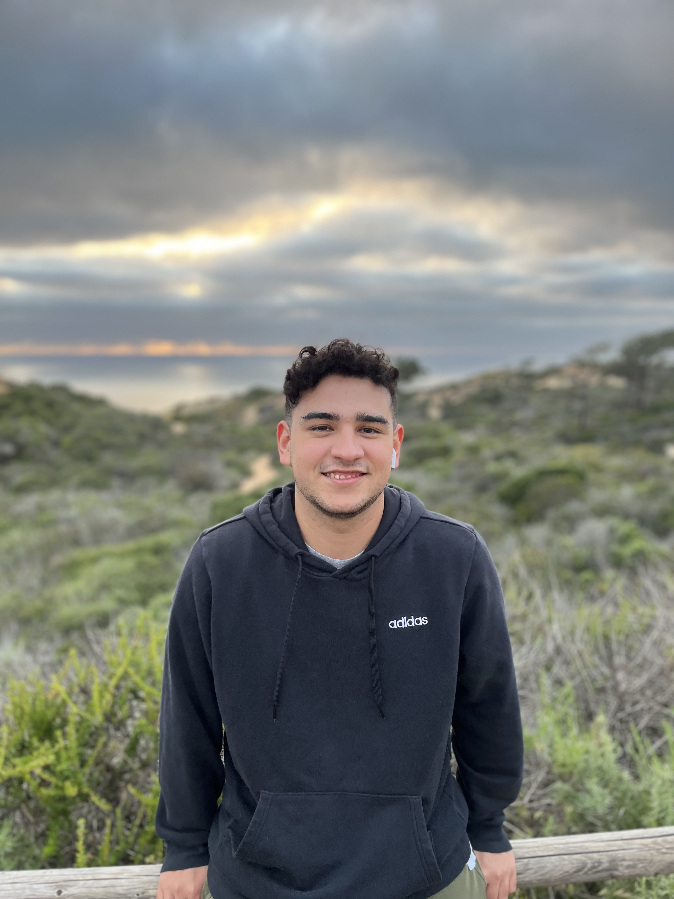

# Hello! 🦭

<table>
<tr>
  <td>
    
  </td>
  <td>

## About Me 🙇🏻‍♂️

I am a **senior at UC San Diego** studying **Cognitive Science**. I specialize in **Machine Learning** and am currently taking a class on **Large Language Models**. On top of CogSci, I am also a **Computer Science** minor!

I started learning programming at my community college where I earned my Associate of Science in CS. I have experience programming in **C/C++, Python, Java, and JavaScript**.

My drive to learn how to program has even pushed me to take classes on UDEMY's online learning platform. This is where I learned that basics of **Web Development**: HTML, CSS, and JavaScript!

In pursuit of a career in software engineering, I have gained experience working on **real world applications**! During my time at UCSD, I have served as a **software developer** for the **Computer Science and Engineering Society** (_CSES_). As a software developer with CSES, I have experiencing working on **full stack applications** using libraries and frameworks such as **React.js, Angular, Django, and Express.js**. I am also familiar with databases such as **SQL and MongoDB**. I am proud to have contributed on projects such as **The Tritones Website**, and **The Schoolhouse Ghana Project**.

If you have any questions regarding my experiences feel free to reach out to me either through email or on LinkedIn!

Email: nicholascampos013@gmail.com

LinkedIn: @nicholas-campos

  </td>
</tr>
</table>
